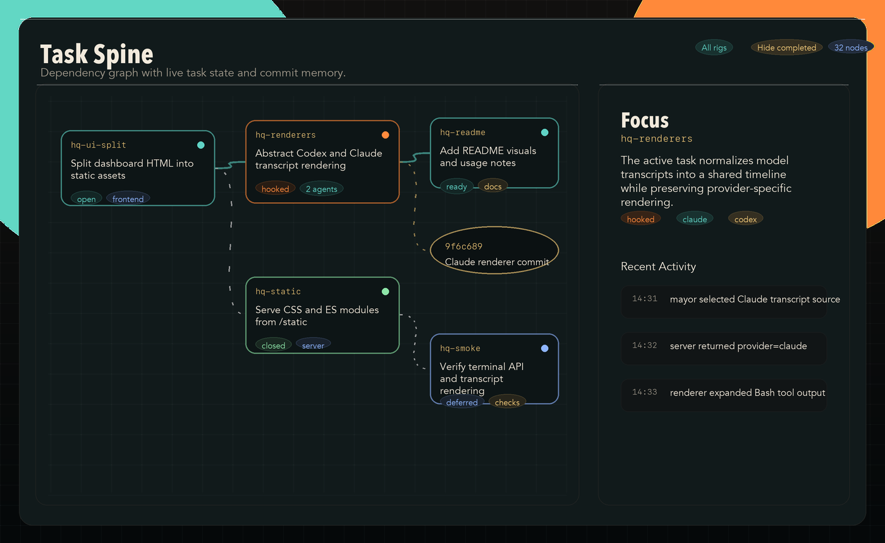
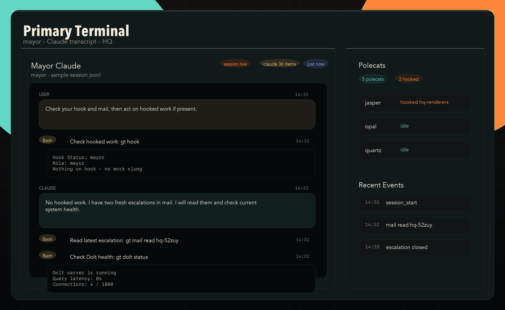

# GTUI

GTUI is a desktop dashboard for a [Gas Town](https://github.com/vernon99/gastown)
workspace. It visualises the task spine, agent activity, git memory, and live
intervention hooks (retry, pause, nudge, inject) for a local `gt` workspace.

GTUI ships as a [Tauri](https://tauri.app) application: a native Rust backend
(`src-tauri/`) embedded with a static single-page WebView frontend (`src/`). The
original standard-library Python implementation is preserved under
[`webui/`](webui/README.md) for reference and as a portable fallback.

## Screenshots

The screenshots below use representative sample data.





## Prerequisites

- **Rust toolchain** — stable Rust 1.77 or newer (`rustup install stable`).
- **Tauri CLI** — `cargo install tauri-cli --version "^2"` (installs `cargo tauri`).
- **macOS / Linux / Windows** platform dependencies for Tauri — see the
  [Tauri prerequisites guide](https://tauri.app/start/prerequisites/).
- A local Gas Town workspace (defaults to `~/gt`; override with `GT_ROOT`).

The Python webui additionally needs Python 3.9+.

## Quick start

From a fresh clone:

```bash
cd src-tauri
cargo tauri dev        # launches the desktop app with hot reload
```

To produce release binaries and installers:

```bash
cd src-tauri
cargo tauri build
```

The build outputs land in `src-tauri/target/release/` and, for macOS,
`src-tauri/target/release/bundle/macos/GTUI.app` plus a `.dmg` image. On Linux
you get AppImage/Deb, on Windows MSI/NSIS.

By default GTUI reads the workspace at `~/gt`. Override that with the `GT_ROOT`
environment variable before launching:

```bash
GT_ROOT=/path/to/gt cargo tauri dev
```

## Architecture

```
gtui/
├── src-tauri/          # Rust backend (Tauri host process)
│   ├── src/
│   │   ├── main.rs     # Entry point (delegates to lib::run)
│   │   ├── lib.rs      # Tauri builder + IPC handler registration
│   │   ├── config.rs   # GT_ROOT / workspace resolution
│   │   ├── command.rs  # Shell-out helpers for `gt`, `git`, tmux
│   │   ├── parse.rs    # Parsers for gt / git / session outputs
│   │   ├── sessions.rs # Claude / Codex session discovery
│   │   ├── models.rs   # Serde types exposed over IPC
│   │   ├── snapshot.rs # Periodic snapshot builder + cache
│   │   └── ipc.rs      # #[tauri::command] entry points
│   ├── capabilities/   # Tauri capability manifests
│   ├── icons/          # Bundle icons
│   ├── tests/          # Rust integration tests + fixtures
│   ├── Cargo.toml
│   └── tauri.conf.json
│
├── src/                # Frontend (static SPA loaded by the WebView)
│   ├── index.html
│   └── static/         # CSS, JS modules, renderers
│
├── webui/              # Legacy Python implementation (see webui/README.md)
├── docs/               # Supplementary docs and screenshot assets
└── README.md
```

The Rust backend polls the Gas Town workspace on a background Tokio task
(`SnapshotStore::spawn`), builds an immutable snapshot, and exposes it to the
frontend via `#[tauri::command]` IPC handlers registered in `lib.rs`. The
frontend fetches snapshots, terminal transcripts, and git diffs via
`window.__TAURI__.core.invoke` (see `src/static/js/`).

For how to extend the backend, modify the frontend, or run the test suite, see
[`docs/developing.md`](docs/developing.md).

## Legacy web UI

[`webui/`](webui/README.md) contains the original implementation: a static HTML
SPA served by a single-file Python standard-library backend. It predates the
Tauri port and is preserved for comparison and as a zero-dependency fallback.

```bash
cd webui
python3 server.py
```

Then open <http://127.0.0.1:8420>.

## Notes

- GTUI is designed for local use. The legacy server binds to `127.0.0.1` by
  default; the Tauri app runs entirely in-process with no network listener.
- The backend adds `~/.local/bin` to `PATH` when shelling out so local `gt` and
  related commands can be discovered.
- Runtime logs, PID files, and Tauri build artifacts are git-ignored.

## License

MIT. See [LICENSE](LICENSE).
